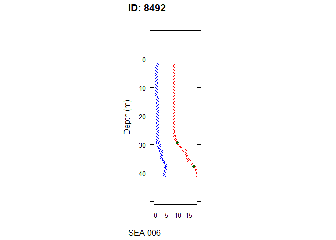

Oxygen Debt Indicator Calculation Scripts
-----------------------------------------

The following as an example of fitting the HEAT oxygen debt profile models to CTD or water bottle data. The code below assumes that the repository has been cloned and all work is done from the root directory `.../HEAT/`, and that the data has been downloaded and prepared via:

``` r
source("scripts/OxygenDebt/01_input.R")
```

This will create the folder `model` and the file `model/input.csv`.

``` r
# read in data
oxy <- read.csv("model/input.csv")
head(oxy)
```

    ##   ID Assessment_Unit Year Month Day Latitude Longitude Type Depth
    ## 1 21         SEA-009 2010    12   4 55.79984  18.34617  CTD     0
    ## 2 21         SEA-009 2010    12   4 55.79984  18.34617  CTD     1
    ## 3 21         SEA-009 2010    12   4 55.79984  18.34617  CTD     2
    ## 4 21         SEA-009 2010    12   4 55.79984  18.34617  CTD     3
    ## 5 21         SEA-009 2010    12   4 55.79984  18.34617  CTD     4
    ## 6 21         SEA-009 2010    12   4 55.79984  18.34617  CTD     5
    ##   Temperature Salinity   Oxygen n_Oxygen max_depth Oxygen_ml
    ## 1        6.23     7.09 11.23836       11    100.69      7.87
    ## 2        6.23     7.08       NA       11    100.69        NA
    ## 3        6.23     7.08       NA       11    100.69        NA
    ## 4        6.23     7.08       NA       11    100.69        NA
    ## 5        6.23     7.08       NA       11    100.69        NA
    ## 6        6.23     7.08       NA       11    100.69        NA
    ##   Oxygen_deficit        Basin surfacedepth1 surfacedepth2 salmod_wt_depth1
    ## 1       1.035793 Gdansk Basin            10            20               50
    ## 2             NA Gdansk Basin            10            20               50
    ## 3             NA Gdansk Basin            10            20               50
    ## 4             NA Gdansk Basin            10            20               50
    ## 5             NA Gdansk Basin            10            20               50
    ## 6             NA Gdansk Basin            10            20               50
    ##   salmod_wt_depth2 salmod_wt salmod_halocline_lower salmod_max_depth    ES
    ## 1              120         3                     30               40 10.54
    ## 2              120         3                     30               40 10.54
    ## 3              120         3                     30               40 10.54
    ## 4              120         3                     30               40 10.54
    ## 5              120         3                     30               40 10.54
    ## 6              120         3                     30               40 10.54
    ##     ET ET.SCORE weight inBSEP133
    ## 1 8.66        H    100      TRUE
    ## 2 8.66        H    100      TRUE
    ## 3 8.66        H    100      TRUE
    ## 4 8.66        H    100      TRUE
    ## 5 8.66        H    100      TRUE
    ## 6 8.66        H    100      TRUE

Now that the data are read in, the following code loads the `oxydebt` package for the `doonefit_full` and `plot_fit` functions.

``` r
# load libraries
library(oxydebt)

# inspect the results from one fit
ID <- 8492
data <- oxy[oxy$ID == ID,]
fit <- doonefit_full(data, ID = ID)

p <- plot_fit(fit, data)
print(p)
```


